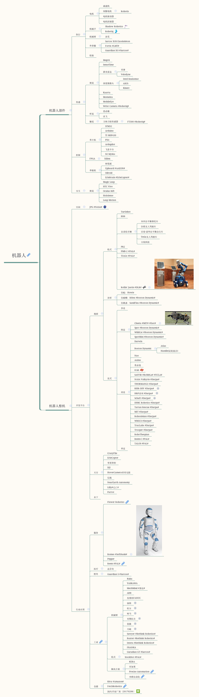

# Roboseum
A Robot Museum for Skyworkers!

这个项目对一些有名的机器人实验室和公司的产品进行产品，主要从硬件角度进行分类。采用Markdown和标签的方式记录和分类。供身边的机器人爱好者参考。当然也欢迎大家积极贡献。

## 分类标签定义
可直接通过本标签树的叶子节点搜索对应的机器人。

- 机器人
	- 机器人整机
		- 地面
			- 多足
			- 四足
			- 双足
			- 单足
			- 轮式
		- 天空
		- 水下
		- 空间
		- 医疗
		- 工业
	- 机器人部件
		- 执行器
			- 电机
			- 机械手
			- 机械臂
			- 轮胎
		- 传感器
			- 视觉
			- 听觉
			- 触觉

## 如何Contribute
1. 发起pull request(非项目成员贡献方式)
2. 联系项目作者，成为collaborator。

push方法

	git clone https://github.com/thu-skyworks/Roboseum.git
	# 在Roboseum中做一些修改
	cd Roboseum
	git add *
	git commit -m "description of changes that you made"
	git push origin master

## 同步方式
对于每一个机器人，我们会添加多个标签，包括其开发者的实验室或公司，机器人硬件的用于等。可以通过标签搜索对应的机器人，我们把所有的标签同步在github README.md上。

同时，为了方便可视化和检索，分类树会放在xmind里面，xmind文件也会在github上同步。
