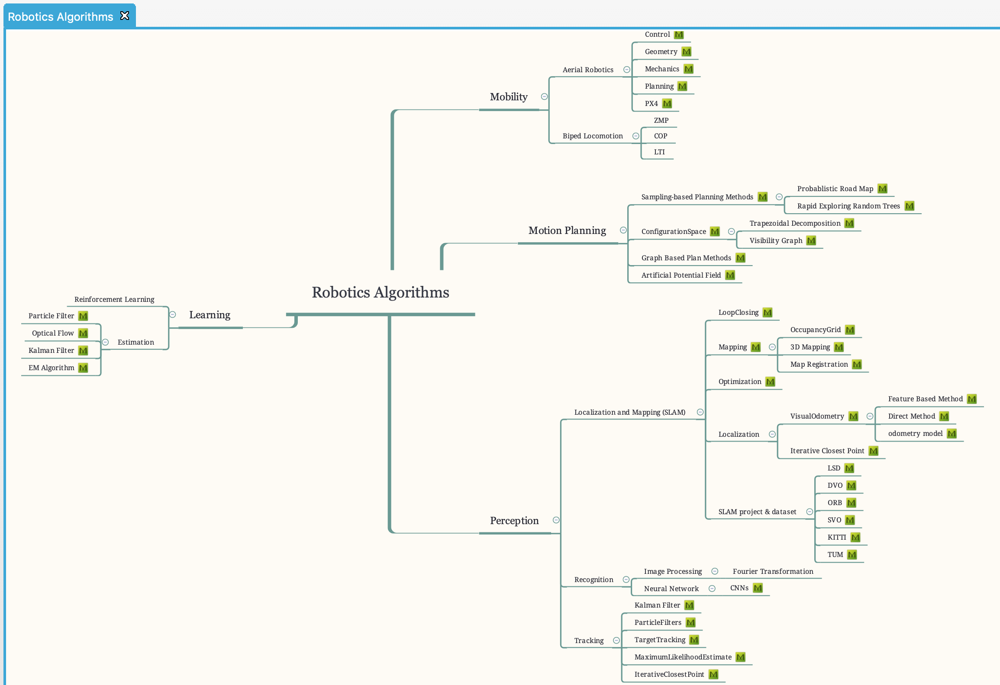

# Roboseum

>**Welcome to the Robot Museum！**
>**欢迎来到机器人大观园！**

## 引言
我们是一群来自清华各工科院系(机械/信息学院下的机械系、自动化系、电机系等院系)的机器人爱好者，希望对优秀的机器人软硬件科技进行收集、归纳、整理、分类和介绍，并涵盖学界前沿设计、业界公司产品两个方面。目前我们主要从机电硬件系统和软件算法原理两个维度展开，共收集了全球20余家公司/实验室的34种产品，和近50种软件算法。我们采用Markdown标记语言编写条目，并根据自己对机器人学的理解使用Xmind进行知识树式的组织管理和索引，并且为每个条目提供多个标签用以适应各种多样化的查询需求。

我们认为机器人学是汇集机械、电子、计算机等多个领域的一片汪洋大海，我们希望身边有志于成为机器人学家的少年们在扬帆出海的时候会发现我们提供的这张海图对你有用，能帮你看清方向，少走些弯路。当然也欢迎更多的"老船长"加入我们，积极贡献，共同丰富、扩充这张海图~

主要作者：
- 机电硬件系统部分：[顾兆元](https://github.com/guzhaoyuan)（机械系）、[小山嘉](https://github.com/sicoco)（电机系）、[郑亦平](https://github.com/Yiping-Steven)（自动化系）
- 软件算法原理部分：[郑亦平](https://github.com/Yiping-Steven)

最后更新于：2018年12月31日

顺便一提，我们认为“航海”的意义在于寻找秘宝的探险和给世界创造新的价值，我们希望打开的是宝箱而非是潘多拉魔盒（eg. CRISPR基因编辑）。为此，如果有朋友对于机器人伦理道德有浓厚的兴趣，欢迎<a href=mailto:yipingz18@jhu.edu>联系作者</a>，加入到一部关于机器人给社会带来现实问题的硬科幻小说的创作讨论中来~ (目前情节架构已定，正在为细节取材)

## 关于分类标签的定义
可直接通过本标签树的叶子节点搜索对应的机器人。

## 一个Robot应该涵盖哪些基本信息？
关于markdown内容如何组织，一个机器人有哪些关注点的问题。
加粗的为必须有的最基本内容。

- **tag**，tag是必不可少的组件，在编辑前可以先加上所有的tag
- **生产该机器人的公司或实验室**
- **机器人硬件参数**
- **机器人应用场景**
- 机器人的视频
- 机器人的论文资料
- 机器人获得的比赛奖项或荣誉
- 机器人的介绍网页链接
- 我们感兴趣的点，或者，我们还不知道的可以待大家思考讨论的点

## 如何Contribute
1. 发起pull request(非项目成员贡献方式)
2. 联系项目作者，成为collaborator。

push方法

	git clone https://github.com/thu-skyworks/Roboseum.git
	# 在Roboseum中做一些修改
	cd Roboseum
	git add *
	git commit -m "description of changes that you made"
	git push origin master

## 同步方式
对于每一个机器人，我们会添加多个标签，包括其开发者的实验室或公司，机器人硬件的用途等。可以通过标签搜索对应的机器人，我们把所有的标签同步在github README.md上。

同时，为了方便可视化和检索，分类树会放在xmind里面，xmind文件也会在github上同步。
