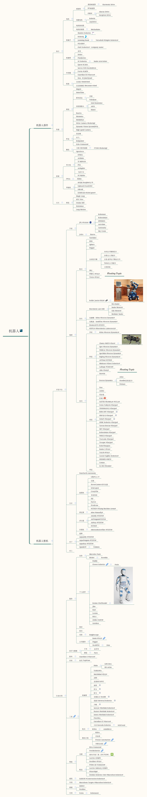

# Roboseum

>**Welcome to the Robot Museum！**

>**欢迎来到机器人大观园！**

我们是一群来自清华的机器人爱好者，希望对优秀的机器人软硬件科技（包括学界前沿、业界公司、产品）进行归纳分类和介绍，目前主要从硬件角度进行划分。采用Markdown标记语言编写条目，并使用Xmind进行组织和索引，并且每个条目提供标签用以查询。供身边的机器人爱好者参考，当然也欢迎大家积极贡献~

## 分类标签定义
可直接通过本标签树的叶子节点搜索对应的机器人。

## 一个Robot可以有哪些基本信息
关于markdown内容如何组织，一个机器人有哪些关注点的问题。
加粗的为必须有的最基本内容。

- **tag**，tag是必不可少的组件，在编辑前可以先加上所有的tag
- **生产该机器人的公司或实验室**
- **机器人硬件参数**
- **机器人应用场景**
- 机器人的视频
- 机器人的论文资料
- 机器人获得的比赛奖项或荣誉
- 机器人的介绍网页链接
- 我们感兴趣的点，或者，我们还不知道的可以待大家思考讨论的点

## 如何Contribute
1. 发起pull request(非项目成员贡献方式)
2. 联系项目作者，成为collaborator。

push方法

	git clone https://github.com/thu-skyworks/Roboseum.git
	# 在Roboseum中做一些修改
	cd Roboseum
	git add *
	git commit -m "description of changes that you made"
	git push origin master

## 同步方式
对于每一个机器人，我们会添加多个标签，包括其开发者的实验室或公司，机器人硬件的用途等。可以通过标签搜索对应的机器人，我们把所有的标签同步在github README.md上。

同时，为了方便可视化和检索，分类树会放在xmind里面，xmind文件也会在github上同步。
