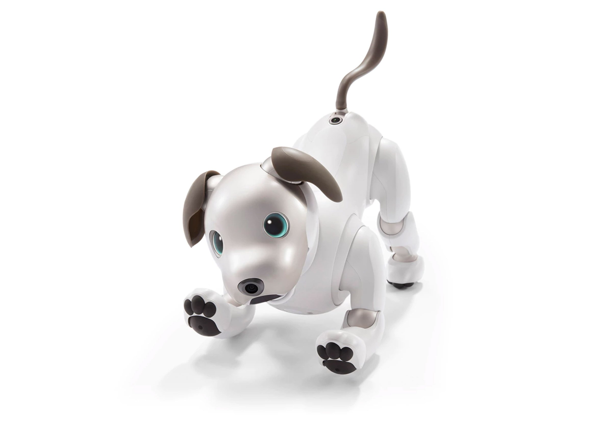
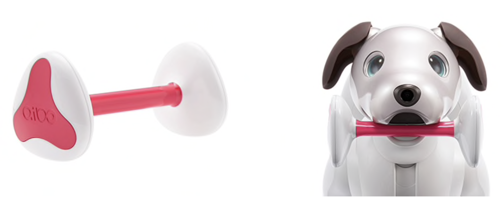

# Aibo
tag: *Sony* *四足* *地面*

---
- 图1

- 图2

Sony大法复活了10年前的品牌Aibo（Artificial Intelligence roBOt），利用人工智能的方法创造了新机器狗。在2017的新款前，已经有数款Aibo发布。

## 硬件
- 屁股上有向上的摄像头进行slam
- 4核CPU
- 内置LTE and WiFi
- 4个麦克风
- 音响
- gyroscopes
- motors，22-DoF
- 2小时电池续航

2017年11月价格：$1700

## 应用场景
家居服务，人机交互等

### Aibo的技能表：
- learn the layout of your house over time
- OLED显示眼，可以显示心情，眨眼
- 避障，向目的地前进
- 记住能让主人快乐的动作（处理视觉，声音，动作数据分析得出）

## 拓展

[新闻报道](https://www.youtube.com/watch?v=lhESLovHII4)
