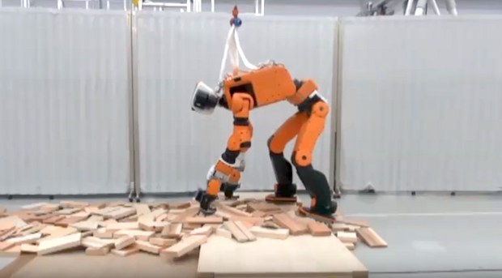
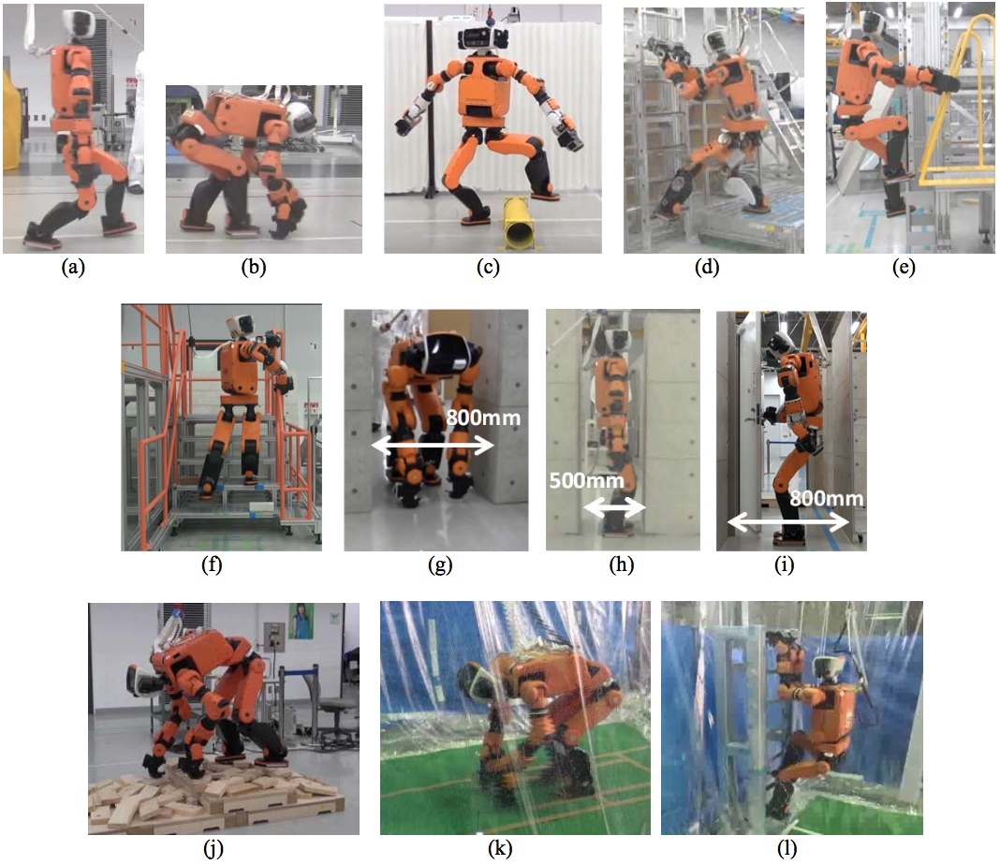

# E2-DR
tag: *Honda 本田* *人形* *地面*

---
- 图1 通过4足并用爬竖直梯子

- 图2 通过四足步态过毁坏的砖块堆

- 图3 各种技能表集合

E2-DR是日本的汽车厂商巨头本田研发的人形机器人，于2017年10月亮相，契机是在IROS 2017上发表的论文。论文的链接中给出了E2-DR的一些demo，演示了机器人攀爬，过障碍，通过不同地形的能力。

早在2015年，Honda在IROS2015上就展示了其救援机器人的一些技能研究，那时的机器人是E2-DR的原型，没有如此美观的外表和性能，但是大体结构上一致。

## 硬件
### 2017年10月时的公开的性能表：
#### 尺寸

- 身高 168cm（比Asimo高38cm）
- 深度 25cm（比Asimo还薄）
- 重量 85Kg

#### 性能

- 最大速度 9km/h
- 电池 1000-Wh锂电池
- 活动时间 90分钟
- 活动温度范围 -10 and 40 °C
- Intel Core-i7 CPU
- GPU
- 内部冷却系统散热

#### 关节自由度

- 总共 33 D0F
- 头部 1 DoF
- 躯干 2 DoF
- 手臂 8×2 DoF
- 腿 6×2 DoF
- 手 1×2 DoF

#### 传感器

- 头左右两侧各一个Hokuyo激光雷达，激光雷达可通过电机旋转得到3D点云信息
- 头上有一个单目摄像头
- 头上一个SR4000 ToF摄像头
- 头上一个深度摄像头+红外projector
- 每个手上有一个摄像头和一个深度传感

## 应用场景
官方设定是用于救灾，当然人形机器人的用途还有很多。在救灾这个大场景下，也会有很多的技能需要开发。比如开车，过障碍，环境感知等。

### E2-DR的技能表：
- 三维空间的运动，包括爬竖直梯子（包括从梯子下到地面的动作），上楼梯（借助手臂扶hand rail）等
- 狭窄空间的行进
- 跨过地上200mm的管道
- 走过堆满杂乱砖块残骸的地面
- 沿着走廊通过关着的门（需要打开门的操作）
- 走路过程中允许外力扰动（这个视频中体现不明显，外力太小）
- 环境感知，用于运动规划
- 爬高梯时，防止猛烈坠落
- 步行速度 4km/h
- 四足前进速度 2.3km/h
- 在26mm/hour的雨中步行20min
- 在26mm/hour的雨中上下梯子

## 拓展
[机器人介绍（带视频）](https://spectrum.ieee.org/automaton/robotics/humanoids/iros-2017-honda-unveils-prototype-e2dr-disaster-response-robot)

IROS论文

[1] Takahide Yoshiike, Mitsuhide Kuroda, Ryuma Ujino, Hiroyuki Kaneko, Hirofumi Higuchi, Shingo Iwasaki, Yoshiki Kanemoto, Minami Asatani, Takeshi Koshiishi, Honda R&D. **Development of Experimental Legged Robot for Inspection and Disaster Response in Plants**. IROS 2017, Vancouver, Canada.
