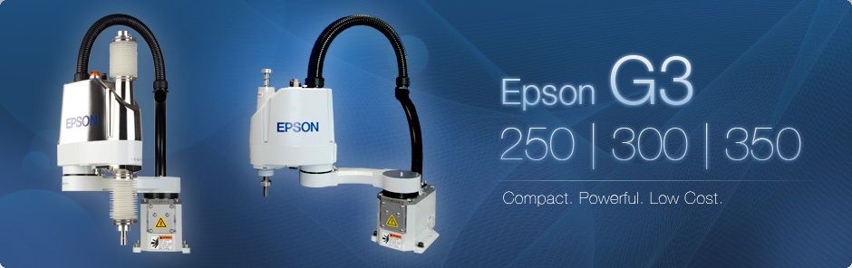
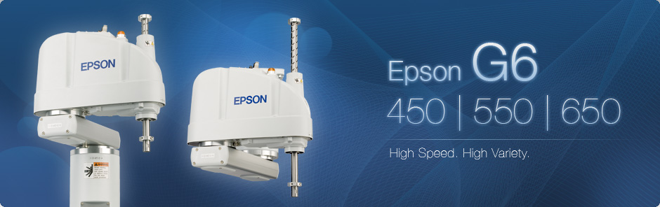
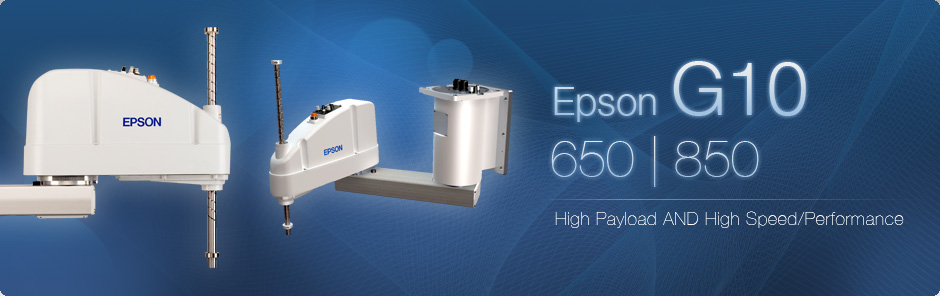
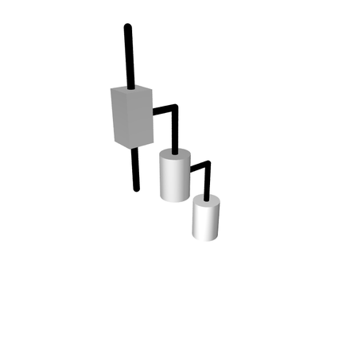

# Epson SCARA Robot Overview
tag: *Epson SCARA* *机械臂* *执行* *机器人部件*

---
- Epson G1

- Epson G3

- Epson G6

- Epson G10

- Epson G20

Epson在机器人领域是做的比较好的一家。经常会听到Epson Robot和安川，发那科等公司一起出现。

他们也是一家做机械臂和控制器解决方案的公司。其实
他们家很著名的就是这款Scara机械臂。Scara（Selective Compliance Assembly Robot Arm or Selective Compliance Articulated Robot Arm）的意思是选择性柔性平面机器人，就是这个机械臂的每个关节在XY平面方向上是带有一定柔性（可Back Drive），在Z方向上是完全刚性的。

Scara机构示意图：

这种机械臂的好处是可以在XY平面运动的非常快（由于运动速度叠加）

## 硬件

由于硬件款式较多，先挖个坑之后补（2017.11.13）

## 应用场景
码垛，生产线搬运，较精密移动零件。

## 拓展
[Epson Scara Robot 官网](http://robots.epson.com/products/1)

[wiki-Scara](https://en.wikipedia.org/wiki/SCARA)
