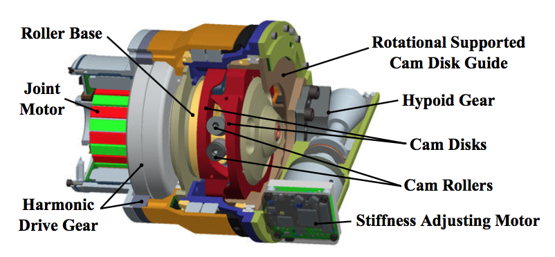
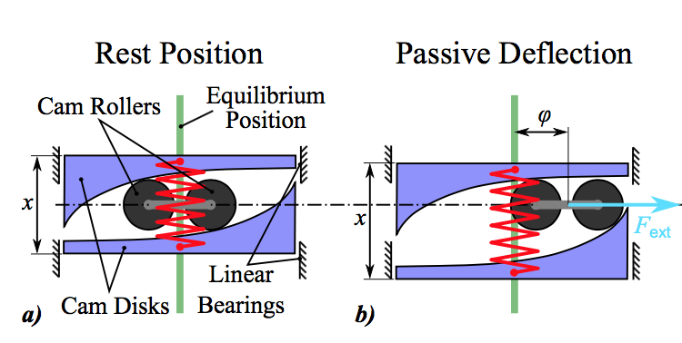
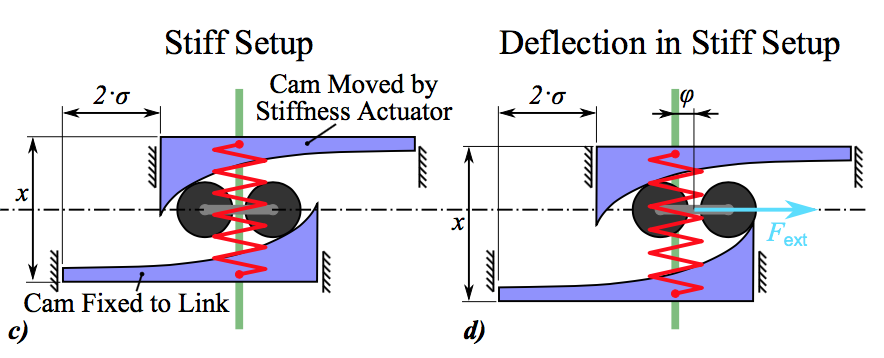

# Floating Spring Joint

tag: *DRL* *VSJ* 

---

Fig1. FSJ外观

Fig2. FSJ半剖图

FSJ最大的亮点是一个关节带有两个自由度，一个自由度用于控制位置，另一个自由度用于控制刚度。但是，由于机械构造的原因，刚度与第二个自由度的电机轴输出为非线性关系，而且，两个自由度之间存在一定的耦合，这给控制和建模带来了难度。

## 变刚度原理

## 拓展
[1] The DLR FSJ: Energy based design of a variable stiffness joint, S. Wolf, et al. ICRA 2011.