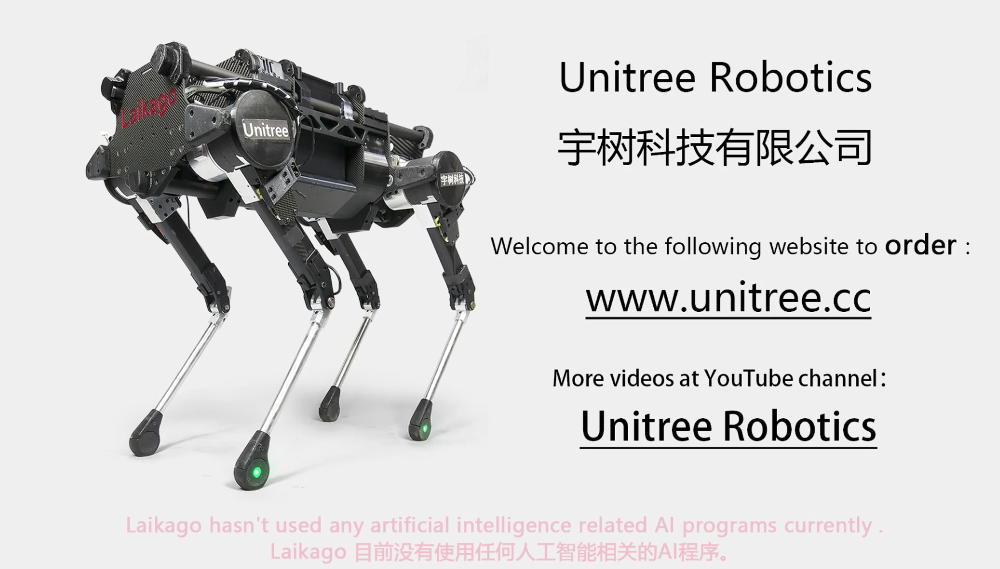
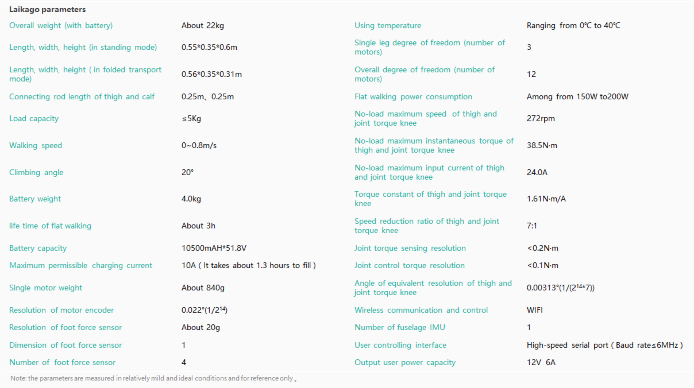

# Laikago 
tag: *Unitree* *四足* *地面*

---
- 图1

- 图2

Laikago是杭州宇树科技(Unitree)开发的一款四足机器人。2017年10月6日推出，瞬间引起国内外机器人爱好者的广泛关注，因为其外形与BDI的大狗类似，并且能够做酷炫的push recovery，一度被认为技术水平距离BDI大狗最近的产品。

可以看出，Unitree团队嵌入式方向极强，机械设计能力极强，而且非常懂电机。

主控用了STM32F4，每个电机单独有驱动。电机TMD是自己绕的，因为根本没有其他好用的电机。大腿和膝盖电机的扭矩有38.5牛米，而且一定有短时超载，散热是很大的问题，他们也在考虑液冷，不过很麻烦，太折腾。一台22kg，也在考虑减重。API有高层和底层接口，高层利用预置步态算法控制前后左右，底层接口可以控制单个电机，不过开放底层很容易摔的，所以维护会很头疼。

之前版本用的同步带，但是腿受冲击容易错齿，非常蛋疼。所以现在改用连杆驱动了，电机都在肚子里，腿非常轻。

Laikago作者推荐Legged Robot that Balance，有机会要拜读一下，书作者是Marc Raibert，Founder and CEO of Boston Dynamics。控制大狗的基本方法Marc在这里有提及。

## 硬件
图为2017年11月的数据：

## Laikago的技能表：
- 不同地形的行走（草地，石块地，20°斜坡上下坡，）
- Push Recovery (行走中受到轻微外力可以抵抗，收到大外力会下蹲降低重心)
- 走路过程身体平稳，可以放倒立的水瓶
- 可以拉动较重行李箱，提供25N的拉力
- Body Following，可以手动调整身体姿态，要求电机有力反馈
- 在动感平台上保持身体平衡
- 可以跳着踏步

## 拓展
[视频链接](https://www.youtube.com/watch?v=d6Ja643GqL8)

[官网](http://www.unitree.cc/)