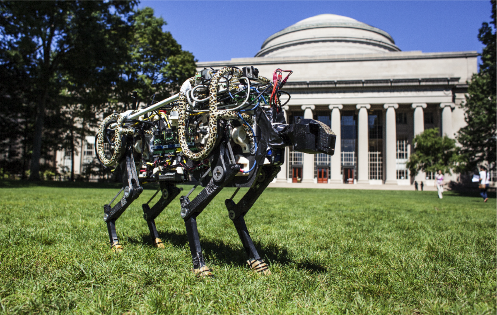
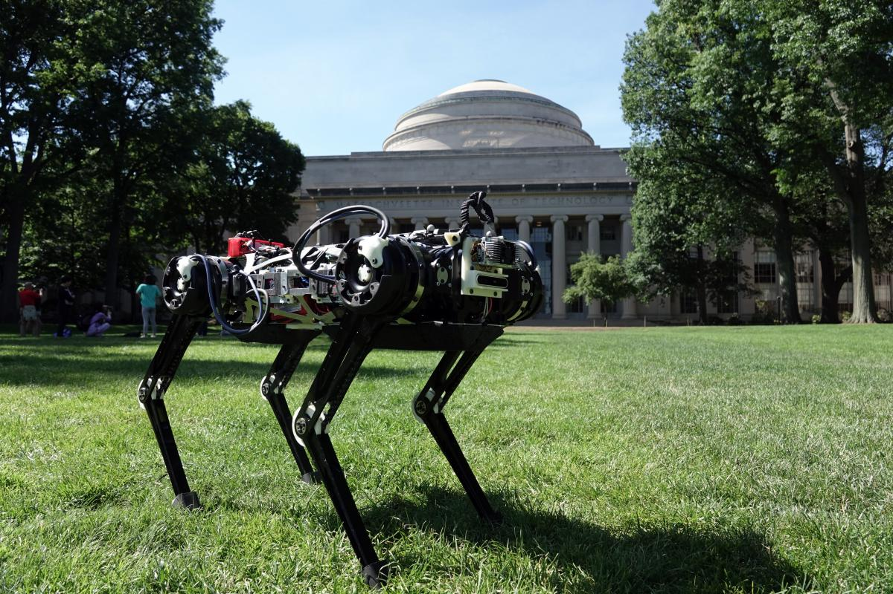
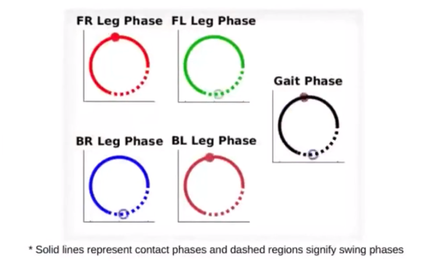

# MIT Cheetah 
tag: *MIT* *BioMimetic Robotics Lab* *四足* *地面*

author: gzy @ Dec. 2018

---

- Cheetah1

- Cheetah2(上面的蜜汁蟒蛇状物体其实是护罩管+猎豹花纹…)

- Cheetah3

The Cheetah robot是MIT Biomimetic Robotics Lab开发的一款四足机器人。从推出第一款至今，MIT的Cheetah可以说是MIT驰名的一个机器人品牌。

实验室老板Sangbae Kim老哥本科毕业自延世大学，中期还当过两年兵。之后就斯坦福，哈佛，MIT各种飞。

## Cheetah1
2009年推出Cheetah1，机器人被固定在跑道上，只能前后移动和pitch，不能roll或者yaw，达到了速度22km/h（比我跑3km的均速还快…）。从实验视频中可以看到，单腿有两个自由度，两个电机并列放在肩膀位置，通过连杆控制两个自由度。这个机器人的试验中还验证了跑步提速过程中**四足步态切换**。（TODO：常用四足步态介绍）

Cheetah1 Spec

Cheetah1主要的目的在于节省跑步能量，上面还有很多技术尝试。比如regenerative motor driver，利用能量存储再生的方式减小跑步过程的动能损失。腿上连接了Kevlar(防弹衣材料) tendor来减小撞地时腿上的冲击。身体前后两部分由中空脊柱连接，脊柱还差分地连上了tendor。（TODO:这部分比较混乱，之后会找文章扩充，求讨论！）。总之是实现了非常强大的生物机理的模仿和机械设计。

TODO：
Cheetah1的控制方法：virtual spring control

## Cheetah1参数

- 最快22km/h
- 功率1Kw
- COT (defined as power consumption divided by weight times velocity), of 0.52. The team says this COT performance rivals that of running animals of the same size. By comparison, Honda's Asimo humanoid has a COT of 2 and Boston Dynamics' BigDog has a COT of 15.
- 普通市面上的电机

## Cheetah2

2015ICRA上发表了Cheetah2，其设计早在2010年就已经开始了。Sangbae Kim老哥显然很擅长搞电机，Cheetah机器人仍然是全电动，这电机算是该实验室的核心技术了。

这次的版本摒弃了柔性脊柱的设计，整个身体成为一个刚体，跑着看起来非常笨重吃力。(不明白这里的设计思路转变，可能刚体更好控，机械参数更好调，更不容易坏。可以想象得出来Cheetah1的时候设计机械结构踩了很多坑，什么线驱动，多自由度脊柱这样的设计，一看就是费死劲了才work。之后的版本再也没有出现过柔性脊柱。)

Cheetah2用上了实验室自研的电机，机器人本体重了很多，可以看得出来电机payload大大增加了。

## Cheetah2的相关控制算法

### 跑步力控算法
跑步的步态用到了impulse planning，这个方法是跑步时规划步态的核心。因为跑步时前腿和后腿分别接触地面，计算腿需要给地面多大的冲量来使得前后两个冲量在跑步时使机器人身体前后摆动保持动态平衡。当跑步速度加快时，接触地面时间变短，同样的动作需要以更大的力冲击地面以得到同样的冲量保持平衡。所以**速度越快电机需要的力越大**。

### 跳跃避障算法：
头顶激光雷达，检测障碍物。在障碍物到来前快速规划，调整步幅，使前脚踩在障碍物前。蹬前脚起身，蹬后脚抬起身体高度。依靠速度飞过障碍物。这样就可以了，是不是很简单呢。关键在于，激光雷达要提前得到障碍物信息，反应时间估计不到1s。调整步态的时间更短，调整完就得立马起跳。要越过40cm障碍物，身高的一半，需要电机给出很大的冲力。说到底**感知决策控制硬件**都很厉害。[这个官方视频](https://www.youtube.com/watch?v=_luhn7TLfWU)简单介绍了跳跃避障算法，值得一看。

TODO：
### 低阻抗设计：无需末端力传感器的力控方案？
low-impedance transmission: Low inertia, low friction, where there’s no stiffness. The inertia and the friction is most of it.

The Cheetah2 trying to maximize the force bandwidth; how quickly you can change force and at the same time maximize the transparency. Transparency means the mechanical impedance between the actuator force to the end effector

All the energy can transfer to the motor side because there’s very little inertia, very little impedance

### 节省能量消耗的可能做法：
one way to save energy is adding parallel springs, not series elastic. Series elastic doesn’t really save force generation, but parallel springs do. We actually have a paper about adding parallel springs.

## Cheetah2参数

- 持续奔跑速度22km/h
- 每条腿2个自由度(2自由度的腿转弯会很蛋疼，视频里跑着饶了一个半径极大的圈才实现转弯)
- 33kg
- 1m长
- 80cm高
- +视觉反馈可达到60km/h的速度（刘翔啊…），the vision sensor detect the ground height to have the contact angle of the leg be accurate
- 有Lidar用以避障，可以检测障碍物，规划步态并且跳过去
- 可以越过33cm的障碍物

## Cheetah3

Cheetah3的造型就很轻盈时尚，很2018了。看到是视频感到各种设计紧凑，动作灵活，太强了。这个设计理念感觉很受Boston Dynamics的SpotMini的启发（虽然只差了1年时间）

## Cheetah3控制方法
官网上挂了一个空的链接标题是Model Predictive Control for Cheetah 3，说明很快会发布MPC的控制方法？

### 稳定过障碍CPG(Central Pattern Generator)
大部分时间四脚着地，左前右后和左后右前交替往前。该步态已经可以用于行走障碍物堆和爬楼梯。[具体效果视频](https://www.youtube.com/watch?v=0RoySGaJNho)。

CPG循环图

### 跳跃步态
很好奇双脚动态交替跳是怎么实现的，这个容我日后实现一个双脚交替跳的步态再来填充。这个应该在Marc的书里有解答。

## Cheetah3参数
- 每条腿3个自由度(相比于前代有很大进步，可以灵巧转身)
- 依然所有电机都在肩膀关节，而且传动采用了骚气的链传动。(虽然机械效率低了点，但是传动比稳定可靠，不会错齿，做这个的小哥肯定很会修自行车🚲)
- 腿部膝关节可以变换弯曲方向
- 重量：32kg

### 能力
- 稳定步态走路
- 稳定步态爬楼梯
- 双脚交替跳
- 双脚交替跳前进
- 双脚交替跳爬楼梯
- push recovery（TODO：这是如何实现的？）
- 跳上76cm的桌子

## 拓展
[Cheetah1 switch running gait](https://www.youtube.com/watch?time_continue=123&v=UBHJqnM8RTU)

[Cheetah1 Leg Swing Test](https://www.youtube.com/watch?v=v-sl6VbnUxc)， 这个2010年的实验可以看到猎豹单条腿是怎么动的，以及肩关节上的同轴二自由度BLDC电机。

[Cheetah1 Press Coverage](https://spectrum.ieee.org/automaton/robotics/robotics-hardware/mit-cheetah-robot-running)

[Cheetah1 Paper](https://ieeexplore.ieee.org/document/6631038)

还有这个实验室引以为傲的[Cheetah电机介绍](https://biomimetics.mit.edu/research/optimal-actuator-design)，这是人家的核心科技

[Cheetah2 Official Website](https://biomimetics.mit.edu/research/dynamic-locomotion-mit-cheetah-2)

[Cheetah2 Press Inteview on ICRA2015](https://robohub.org/robots-cheetah-2/),I think this is very useful since Prof. Kim explained a lot of concept in the inteview.

[Cheetah3 Video](https://www.youtube.com/watch?time_continue=11&v=QZ1DaQgg3lE)

[Cheetah3 Press Coverage](http://news.mit.edu/2018/blind-cheetah-robot-climb-stairs-obstacles-disaster-zones-0705)

TODO: add related paper and read thru.

## 讨论
Sangbae Kim说电机比液压要好。但是，传统电机不好，His group developed its own "three phase permanent magnet synchronous motor," which reportedly doubles the torque density of the commercial motors they were using in the robot!! 给老哥跪下了。再次验证了我的结论，牛逼的机器人一定有牛逼的硬件，牛逼的硬件一定有牛逼的电机支持。所以归根结底还是电机，电机弱的机器人没有希望。该Lab电机的介绍[在这里](https://github.com/thu-skyworks/Roboseum/blob/master/Actuators/MIT%20Optimal%20Actuator%20Design.md)。

此外，官网上还有关于给狗身上加尾巴的研究，这个和CMU的Robomechanics Lab做的事情不谋而合，想利用尾巴对机器人保持平衡。这学期还看到他们lab的同学抬着摔坏的Minitaur回实验室，说是从2m高的台子上跳下来跪了…
