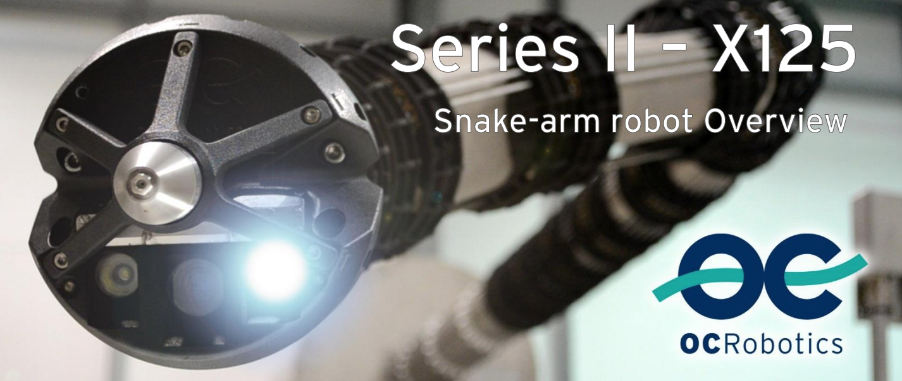
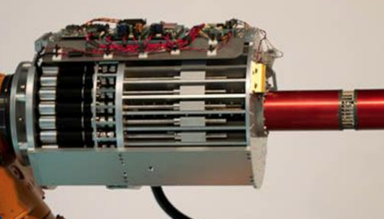
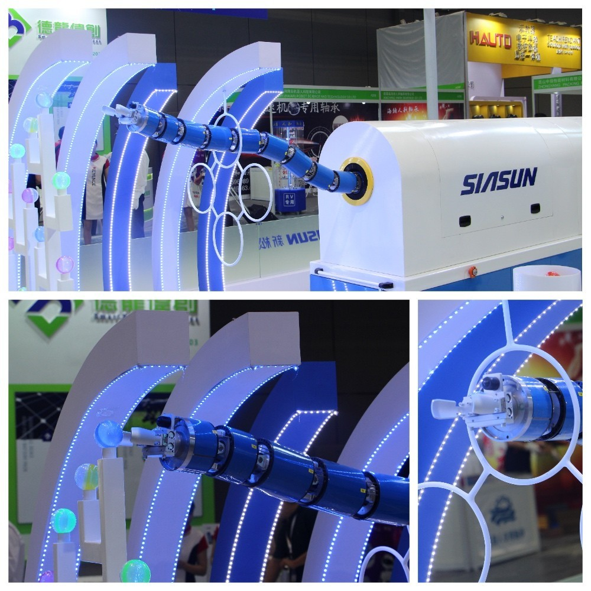

# OC Robotics Snake Arm Robot

Author: gzy

tag: *OC Robotics* *机械臂*

Last update: 2019/1/16

---

Fig1. Snake Arm Robot

Snake Arm Robot Series II 是有英国公司OC Robotics出品的机器人，主要的亮点是狭小空间的工业机械臂操作应用。

## 公司介绍
OC Robotics的口号是“Reaching the unreachable”. 目标的制作在狭小空间进行操作的机器人，主要产品均为蛇形。

## 硬件
由关节和连杆连接而成，共有12个关节和12个连杆，即12段。每个关节有两个自由度，均是由线驱动。每个关节有27.5°的弯曲范围。

## 控制

Fig2. 线驱动控制器

每个关节有一圈的不锈钢线进行驱动，共20根（Series II，不同型号驱动线的数目不同，最多有50根驱动线）。每个线驱动装置均是丝杠和螺母进行线的拉扯。丝杠的旋转由60W 的maxon EC motor无刷电机带动。
20根不锈钢线从基座的螺母出发，连接到不同的关节，就先筋腱拉动手臂一样，拉动不同的关节。具体的机械结构和控制方法，官方没有提供（似乎有专利可寻）。不过官方支持与不同工业应用的厂商进行个性化定制开发，制造具有不同工业应用的机械臂，对每一款的机械结构均有不同。

## 应用
狭小空间的勘探与操作。
末端的工具头可以替换，可以携带摄像头，灯光，高压水枪碰头等。
能够进行path following,即后面关节沿着前面关节经过的空间位置前进，整个机器人的空间形状由头结点决定。

## 类似产品

中国的新松机器人也有一款蛇形机械臂，有12个关节，24+1个自由度。是2018年CIRO上亮相的新款机器人。

## TODO

- [ ]末端通讯控制方式
- [ ]和公司其他产品比较

## 拓展
[Snake Arm 技术文档](http://www.ocrobotics.com/downloads/Website/OC%20Robotics%20-%20Series%20II%20X125%20Snake-arm%20System%20-%20Data%20Sheet%20-%20November%202015.pdf)

[OC Robotics 技术文档](https://www.nasa.gov/pdf/628551main_4C-1_Buckingham.pdf)

[新松机器人新闻](https://robot.ofweek.com/2018-07/ART-8321202-8120-30246257.html)