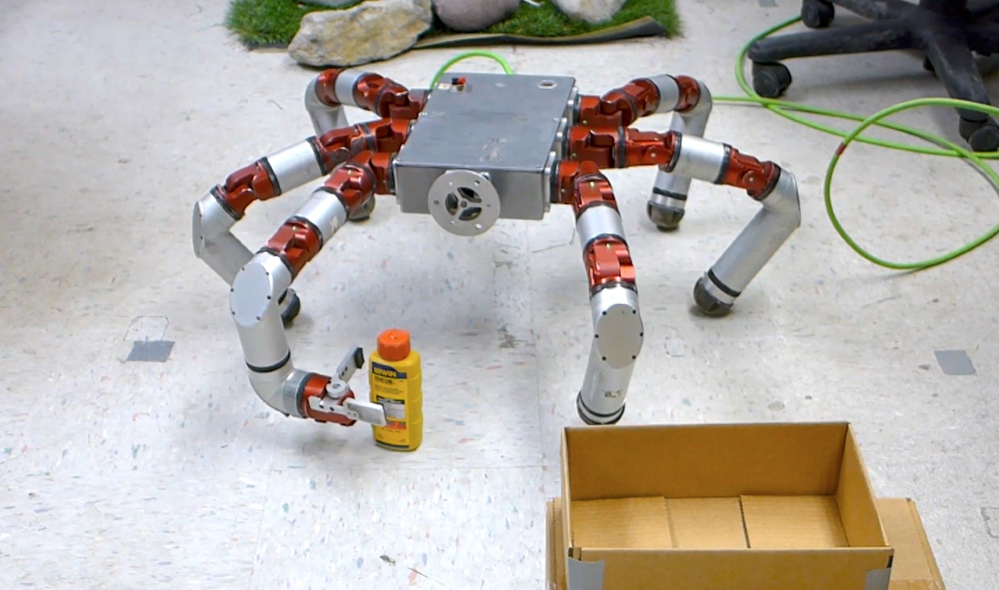
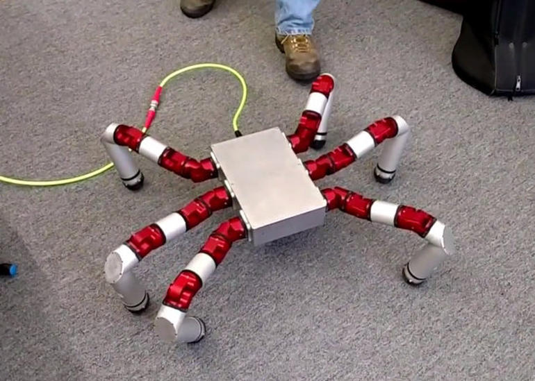

# Snake Monster
tag: *Biorobotics Lab CMU* *仿生* *地面*

---

Fig1. 末端是夹持器的SEA蜘蛛型机器人Snake Monster🕷

Fig2. SEA蜘蛛型机器人Snake Monster🕷

蜘蛛机器人由CMU的Howie Choset带领的Biorobotics Lab开发。其最大的亮点是模块化可拼接的身体。

同系列的还有[蛇形机器人](https://github.com/thu-skyworks/Roboseum/blob/master/robots/SEA-Snake.md)，采用相同的SEA模块化电机拼接而成。关于SEA的描述详见蛇形机器人链接。
## 硬件
蜘蛛机器人的硬件采用模块化的电机连接而成，分为**身体模块**和**6条腿**，以及一个标配的**控制箱**。同一架构的也有4条腿的“蜘蛛机器人”，虽然控制采用的步态不一样，但是硬件本质没有区别。

- 身体模块：带有电源，控制器
- 腿：每条腿都与身体连接，有3个自由度，如果腿的末端是抓取器，则多加1个自由度
- 控制箱：与身体模块的控制器想通讯，主要进行供电和通讯，以及提供好用的用户操作接口
- 电机模块：电机采用模块化，每个电机包括控制板（Ethernet通讯和供电），有一个运动自由度，带减速器，位置传感和IMU姿态反馈，新版带SEA模块。

Snake Monster有无线版和有线版，其实无线版就是把控制器和电源放在身体模块里，而有线版则是由控制箱供电和控制。

## SEA（Series Elastic Actuator）
关于SEA的详细描述，见[SEA-Snake](https://github.com/thu-skyworks/Roboseum/blob/master/robots/SEA-Snake.md)。

其实Snake Monster分为两个版本，带SEA和不带SEA。SEA Snake Monster的柔性在控制上为其带来了很多不便，虽然可以做力控，但感觉算法仍然没有达到那个水平。就目前的控制效果来看，用传统的控制方法控制带SEA电机显然给机器人带来了一定的不稳定。（尤其在机器人举腿的时候，腿各种在空中晃，严重影响落地点的控制，见视频1）

但是，力控也带来一个好处，就是可以暴力踩它。这一点说明了SEA电机的力控性能，即在有大外力干扰的情况下。机器人能够增大力矩抵抗干扰，在无干扰或小干扰情况下，机器人就可以减小力矩，这样可以减小功耗，减小冲击（增加了柔性）。

## 步态
蜘蛛机器人采用3足步态，采用CPG（Central Pattern Generator）算法。（什么是CPG，欢迎@guzhaoyuan讨论）

## 应用场景
多足机器人的好处就在于特别适应地形，它可以轻松地走过斜坡，充满障碍和多种材质的地形。而这些功能，在双足机器人上没有一个是能够轻松解决的。

多足可以有很多花样，比如Fig1中的将一个足改为机械臂，这样就可以做移动抓取。

在研究层面，可以研究的点有，改变足的数量，做机器人的自适应控制。比如，在损失一个甚至两个腿的情况下，如何控制机器人仍然完成移动任务。
## 拓展
[蜘蛛机器人链接](http://biorobotics.ri.cmu.edu/robots/SEAModularity.php)，同时介绍了SEA Module，即电机的信息。

[视频SEA Snake Monster](https://www.youtube.com/watch?time_continue=34&v=rULs2E9dpHQ)，SEA的柔性在这里体现的非常明显。

更鬼畜的是，他们把控制器和腿改造成了[双足机器人](https://www.youtube.com/watch?time_continue=35&v=7CciHJ6SP_o)，虽然不能走，但是能简单地站立并且抵抗一些外力。