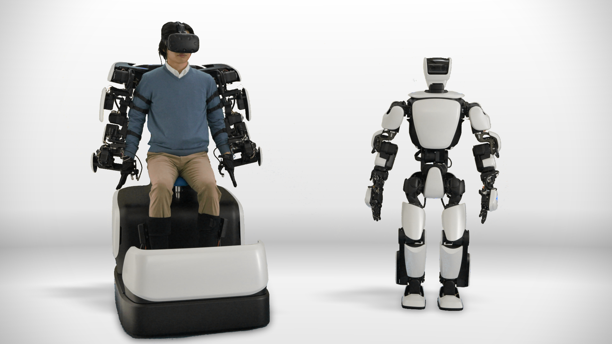

# T-HR3
tag: *Toyota 丰田* *人形* *外骨骼* *虚拟现实*

---

### 一些info：
1. honda=本田，toyota=丰田
2. toyota于2017年11月最新出的人形机器人

### 机器人的优点：
1. 力矩伺服。这个做的非常棒，机器人的关节有应变式的力矩传感

图：力矩执行器的机械结构

这是Toyota和Tamagawa Seiki and Nidec Copal Electronics合作的关节，用于测量力矩。该关节同时用于T-HR3和Master Maneuvering System.
2. 远程控制（Master Maneuvering System, MMS). VR+关节力反馈+数据手套，整体方案做的非常棒. 更有猜测，可以利用示教的数据作为机器学习的数据，用以学习控制机器人的策略。

### 机器人的问题：
1. 因为人的姿态和机器人姿态不是完美对应，有一个bias，所以人和机器人不能同时操作同一个物品。
2. 机器人各种抖抖抖，传感器拿到的值也不是特别的精确，或者说没有很好的滤波，所以电机得到的指令一直在tremble。
3. 机器人的操作一直慢半拍。不知道是通讯时延还是数据处理的问题，又或者是机器人执行速度更不上（毕竟有力控，执行速度会比较慢）。时延十分明显，可以达到0.5甚至1s。毕竟那么多关节的实时同步控制太难。
4. 从demo中单腿支撑恢复双腿站立的瞬间，上身明显晃动，足以判断脚底没有压力传感。
5. 机器人甚至连一步都没有走，显然是怕摔，主要精力可能都放在上半身了。而遥操作的座椅不支持控制行走步态，原因可以参考：[知乎：为何双足机器人不直接拷贝人类行动时的数据？](https://www.zhihu.com/question/65813578)
所以这个人形机器人就很尴尬，只能模仿上肢动作而不能移动。

## 硬件

#### 尺寸
- 身高 152cm
- 重量 74.8kg (比我重比我矮…)

#### 关节自由度
- 头部 2 自由度
- 手臂 (3+1+3)×2=14 自由度
- 灵巧手 1×2 自由度（？？）
- 腰部 3 自由度
- 腿脚 6×2 自由度
- 总计 32 自由度

#### 遥操作自由度（手臂+手，带力反馈）
- 肩膀 3×2 自由度
- 肘 1×2 自由度
- 手腕 3×2 自由度
- 手 1×2 自由度（？？）
- 总计 16个关节传感

#### 传感器
- 头部：双目视觉（可能只是用于传输数据给HTC VIVE）
- 关节：力矩传感

#### 远程控制（Master Maneuvering System, MMS)
利用了HTC VIVE的虚拟现实来实时展现机器人看到的图像，并且通过MMS的位置传感来控制机器人。机器人将得到的力矩反馈通过MMS来施加在操作者身上，这是一个非常棒的解决方案。但是问题也不少，见开头。

## 应用场景
Toyota官方称 "this is a platform with capabilities that can safely assist humans in a variety of settings, such as the home, medical facilities, construction sites, disaster-stricken areas and even outer space.""
### T-HR3的技能表：
- 较低时延的遥操作机器人
- 单脚站立做各种姿势（预先编程确定各关节角然后执行）

## 拓展
[demo视频](https://www.youtube.com/watch?v=GTw7q3-Bn6M)

[报道（含更多视频）](https://www.google.com.hk/url?sa=t&rct=j&q=&esrc=s&source=web&cd=7&ved=0ahUKEwi49bDhgtzXAhUN2WMKHXN-Df8QFghBMAY&url=https%3a%2f%2fwww%2eengadget%2ecom%2f2017%2f11%2f21%2ftoyota-t-hr3-robot%2f&usg=AOvVaw2D1Qf048U6b_buHHDM9Dbf)