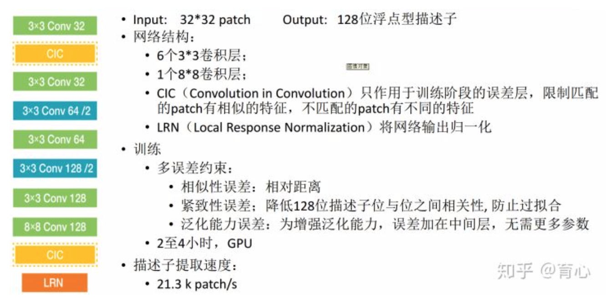
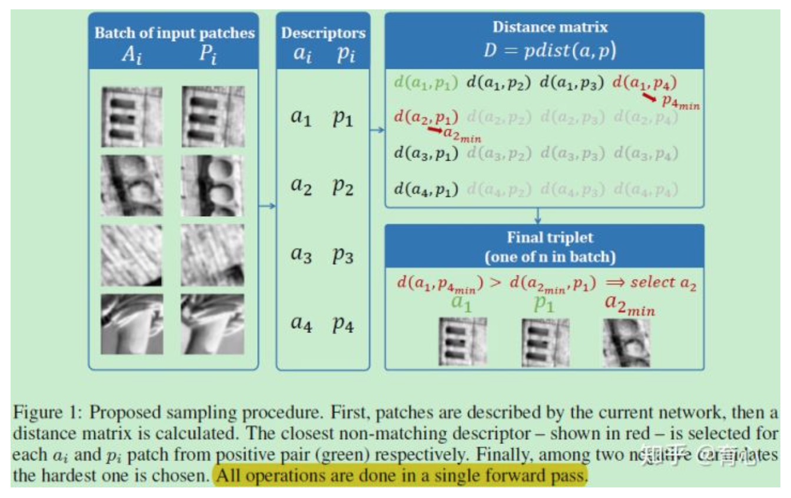
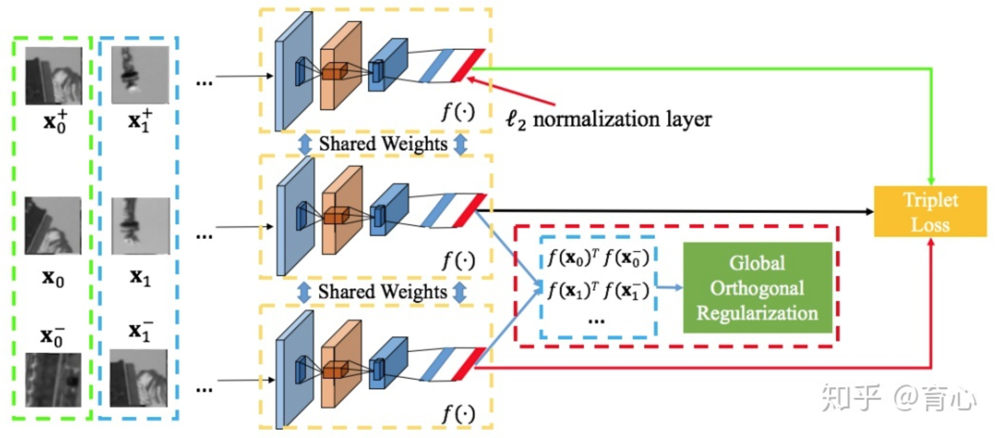

学习型描述子

目前深度学习的识别率/匹配率是绝对比传统的匹配算法如SIFT要高的，但是深度神经网络识别率的提高建立在需求大量训练样本的基础上，在一些没有训练样本的应用（image stitching/ stereo mathing）仍然无法很方便的使用DNN来识别和匹配。但是未来会逐步侵占SIFT/SURF这种固定特征提取算法的生存空间。

- L2Net: progressive sampling strategy，relative distance between descriptors and extra supervision. CVPR 2017

- HardNet: Working hard to know your neighbor's margins: Local descriptor learning loss. NIPS 2017
- DeepCD: learns a pair of complementary descriptors of binary and float. ICCV 2017
- Spread-out: regularization term to maximize the spread in feature descriptor inspired by the property of uniform distribution. ICCV 2017 ( pairwise and triplet losses + regularization technique)
- PPFNet: Global Context Aware Local Features for Robust 3D Point Matching. CVPR 2018 (N-tuple loss, 3D point cloud)
- End-to-End Learning of Keypoint Detector and Descriptor for Pose Invariant 3D Matching. CVPR 2018 (depth image)

L2Net

第一个工作是L2Net，输入是32*32 patch，输出是128位浮点型描述子，它输出的描述子能够在欧氏空间采用L2范数进行匹配，因此命名为L2Net。

该方法的原创性体现在以下四个方面：
> 采用了一个渐进的采样策略，使得网络在有限步内能够获得大量的样本；
针对块匹配问题，描述子对描述子间的相对距离给予更高的权重；
在中间的特征层施加了额外的监督；
描述子的压缩性也被纳入了考虑范围。

HardNet
第二个工作是HardNet，受到Lowe的SIFT的匹配标准启发，引入一种度量学习所用的loss（最大化一个batch中的最近正样本与最近负样本的距离），作为目标函数。将这个loss与L2Net的结构结合，构成了HardNet 。

代码链接：[DagnyT/hardnet](https://link.zhihu.com/?target=https%3A//github.com/DagnyT/hardnet)

PPFNet
第五个是PPFNet，目的是为3D点云生成理想且鲁棒的3D局部特征子。该方法基于深度学习方法来生成易区分且抗旋转的3D局部特征子，首先，将一些简单的几何特征属性如：点的坐标、法线以及点对特征（point pair features, PPF），组合起来成原始特征；接着，又设计了一个新的损失函数：N-tuple Loss。其类似于contrastive loss，能同时将多个同类或者不同类样本嵌入到一个欧式空间中，样本之间的差异用其特征向量的欧式距离表示。最后，PPFNet网络的结构继承自PointNet，因此它天生就可以处理点云以及应对点的无序性。
最后，PPFNet网络的结构继承自PointNet，因此它天生就可以处理点云以及应对点的无序性。
