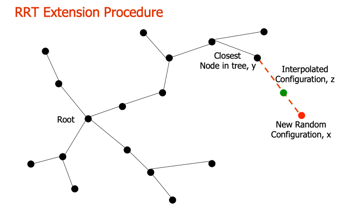
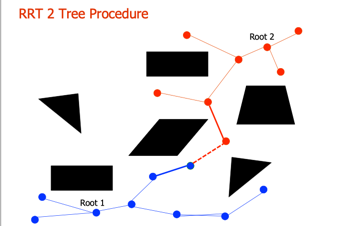

# Rapid Exploring Random Trees

- Add start node to tree 
- Repeat n times
	- Generate a random configuration, x
	- If x is in freespace using the CollisionCheck function
		- Find y, the closest node in the tree to the random configuration 
		- If (Dist (x, y) > delta) – Check if x is too far from y 
			- Find a configuration, z, that is along the path from x to y such that Dist(z,y) <= delta 
			- x = z; 
		- If (LocalPlanner (x,y)) – Check if you can get from x to y Add x to the tree with y as its parent

- While not done
	- Extend Tree A by adding a new node, x 
	- Find the closest node in Tree B to x, y 
	- If (LocalPlanner(x,y)) – Check if you can bridge the 2 trees
		- Add edge between x and y. 
		- This completes a route between the root of Tree A and the root of Tree B. Return this route - --
	- Else 
			- Swap Tree A and Tree B
			- 

