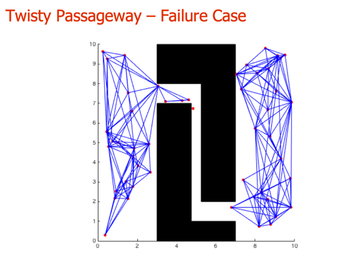

#Characteristics of Sample Based Planners
There are a couple of characteristics of Random Sampling Based approaches that are worth noting.

•  First of all, while these methods work very well in practice they are not strictly speaking complete.

•  A complete path planning algorithm would find a path if one existed and report failure if it didn’t.

With the PRM procedure it is possible to have a situation where the algorithm would fail to find a path even when one exists if the sampling procedure fails to generate an appropriate set of samples.

What we can say is that if there is a route and the planner keeps adding random samples it will, eventually find a solution.

•  However it may take a long time to generate a sufficient number of samples.

•  A real advantage of these PRM based planners is that they can be applied to systems with lots of degrees of freedom as opposed to grid based sampling schemes which are typically restricted to problems in 2 or 3 dimensions.

•  In conclusion by relaxing the notion of completeness a bit and embracing the power of randomization these probablistic road map algorithms provide effective methods for planning routes that can be applied to a wide range of robotic systems including systems with many degrees of freedom.