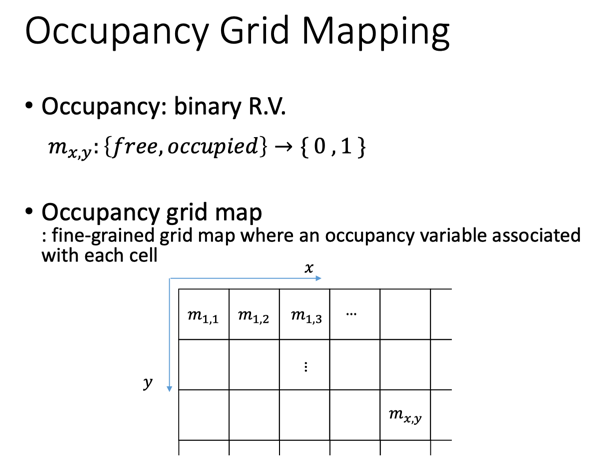
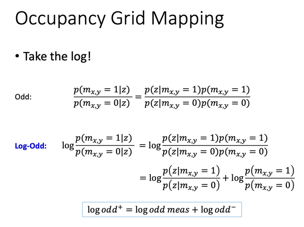

# Occupancy Grid Mapping

一、栅格的定义 将连续空间离散化成一个个栅格。然后每个栅格用一个布尔随机变量来描述：  二、传感器测量模型 激光传感器的一次测量可以确定一条线段上所有栅格是否被占用（不是一般性，假设是单线激光雷达），相应的附一个概率值，总共有如下四中情况  三、带入贝叶斯公式 在（随机）先验的地图下，通过读取激光雷达传感器的测量数据，对地图用贝叶斯公式进行实时更新：  四、Log-odd 定义odd运算，然后再取log，可以将贝叶斯公式中的相乘各项化为相加，达到变量分离方便迭代更新的目的：   

