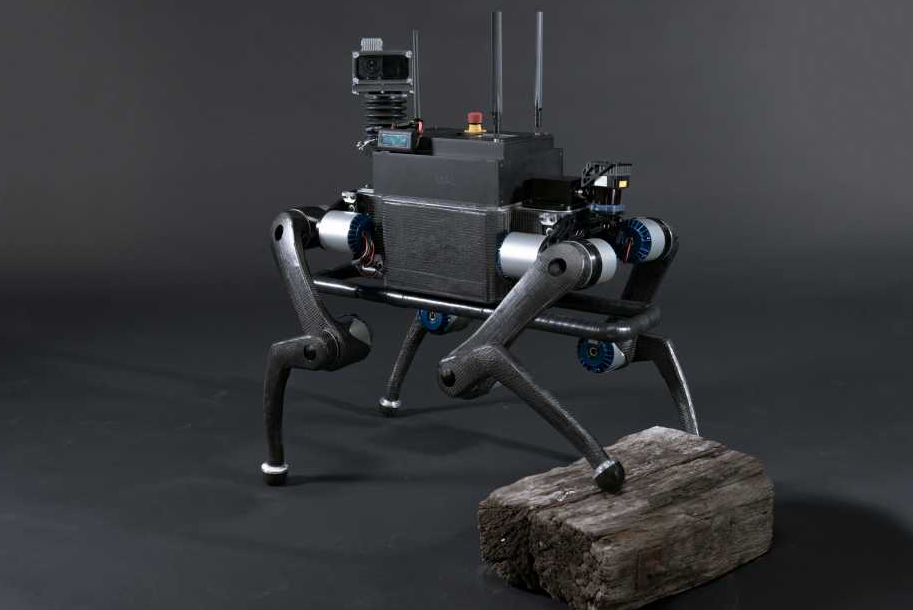

# ANYmal
tag: *ETHZ* *四足* *地面*

author:gzy

Date：2017.11.16

---
- 图1

- 图2

## 概述

ANYmal是ETHZ的Robotic Systems Lab打造的一款四足机器人。其最初应用为油气勘探，灾难搜救，所以它配备了光学摄像头、红外摄像和热成像摄像头，石油气检测仪，主动光源，通讯设备等。它的电池拥有2小时的续航时间。可远程控制或自主导航。

ANYmal的四肢电机通过力矩控制实现柔性（官方说法，关于机器人使用的电机ANYdrive会另外做一个介绍），所以它能够实现动态跑和快速爬。配备了激光雷达和摄像头，能够**实时**对环境建图（包括室内建精确地图和室外粗略地图），并且进行路径规划。

这个机器人非常容易搬运，其躯干设计就是为了搬运而打造的：上方的两个手柄用于抬拉机器人，躯干肚子的平台可以在地面稳妥放置。搬运时，两前腿前伸，后腿向后伸，肚子触地，减小体积。躯干周围的框架结构也在一定程度上保护了机器人免于撞击。

机器人的机械设计也非常轻巧。腿采用碳纤打造，轻且坚固。但是我有一个问题，为什么机器人的小腿要做成弯曲的形状，这个对于机器人有什么好处，为什么要设计这个复杂的形状，这对于机械加工来说无疑增加了成本（见issue2）。机器人每条腿有3个自由度，直立时一条腿有2个pitch和1个roll，酷炫的是腿的2个pitch有360°的旋转自由度。

在狭窄的空间，机器人可以趴下，改四足步态为爬行。爬楼梯的时候也采用了这个作弊的方法，斜趴在楼梯上一级一级往上抬升，改变腿的姿态时身体趴在楼梯上，这也是腿pitch有360旋转空间的好处。ANYmal能够适应各种地形，斜的地面，泥土地，石子路等等都没有问题

## 硬件

#### 尺寸
- 重量 30kg（比Laikago重了不少，不过传感器也多

#### 关节自由度
- 头部 2 自由度
- 腿 3-D0F*4条腿

#### 驱动器
- ANYdrive

#### 传感器
- 头部：Micro-Epsilon Thermal Camera
- 头部：红外传感器
- 头部：视觉摄像头

## 应用场景
油气勘探，灾难搜救等。
### ANYmal的技能表：
- 观察仪表盘并且判断读数
- 上、下台阶
- 爬楼梯（趴着上升，一步一趴）
- 原地旋转

## 拓展
[官网链接](http://www.rsl.ethz.ch/robots-media/anymal.html)
