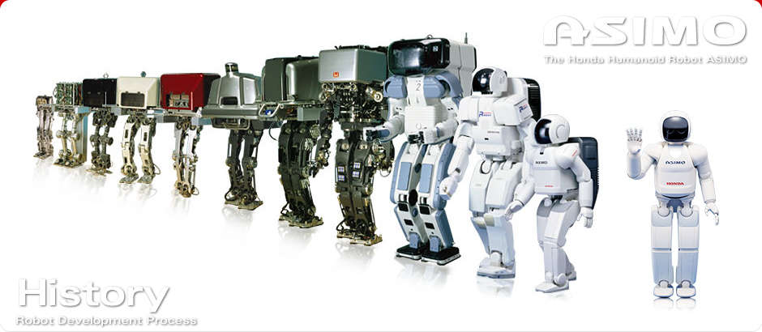

# ASIMO
tag: *Honda 本田* *人形* *地面*

---
- 图1

- 图2

ASIMO是Advanced Step in Innovative Mobility的简称。由日本的汽车厂商巨头本田历经多年研发而成，是日本人形机器人中最尖端的一个，也是最出名，最上镜的机器人。最初以「创造能够与社会共存，协调，并赋予人类社会以新价值的机器人」为愿景，由一群充满热情的本田公司的技术专家，在1986年开始了双足行走机器人的研发。最近虽然没什么新闻了，但是听说本田一直有在持续研发，还开始了抢险救灾版本的ASIMO的研发。

ASIMO能够根据周围的人的行动而自行移动。具有较强的双足自平衡能力。能够利用多个传感器对外界进行精确的感知，并作出复杂的行为。并且ASIMO的手臂拥有足够多的自由度，使得它能够作出许多复杂，拟人的手部动作。

## 硬件

###2011年11月时的公开的性能表：

#### 尺寸
- 身高 130cm
- 宽度 45cm
- 深度 34cm
- 重量 48kg
#### 性能
- 最大速度 9km/h
- 活动时间 40分钟（步行时）可用自动充电功能进行连续活动
#### 关节自由度
- 头部 3 自由度
- 腕部 7×2 自由度
- 手部 13×2 自由度
- 腰部 2 自由度
- 脚步 6 自由度
- 总计 57自由度

#### 抓握力
- 0.5kg/手（五指抓握的状态下）
#### 致动器
- 伺服电机 + 谐波减速器 + 驱动器

#### 传感器
- 脚部： 6轴力传感器（可感知力在脚掌中的分布）
- 腰部： 陀螺仪 + 加速度传感器  

## 应用场景
家居服务，接待，导游等
###ASIMO的技能表：
- 现场解说
- 端茶送水
- 预测行人的行走方向，并自动避开
- 三个人同说说话时识别谁说了什么
- 迎接客人并引导
- 以9km/h的速度行走
- 双足起跳
- 在有凹凸起伏的路上行走
- 单脚跳
- 脚尖射门
- 拿起水瓶，拧开盖子，并倒进纸杯
- 手语
- 人脸识别

## 拓展
[机器人链接](http://www.honda.co.jp/ASIMO/)

[ASIMO英文解说视频](https://www.youtube.com/watch?v=JlRPICfnmhw)

[ASIMO进化史视频](https://www.youtube.com/watch?v=cqL2ZvZ-q14)

[ASIMO公开的技术资料](http://asimo.honda.com/downloads/pdf/asimo-technical-information.pdf)

[ASIMO公开的技术资料2](http://asimo.honda.com/asimo-specs/)
