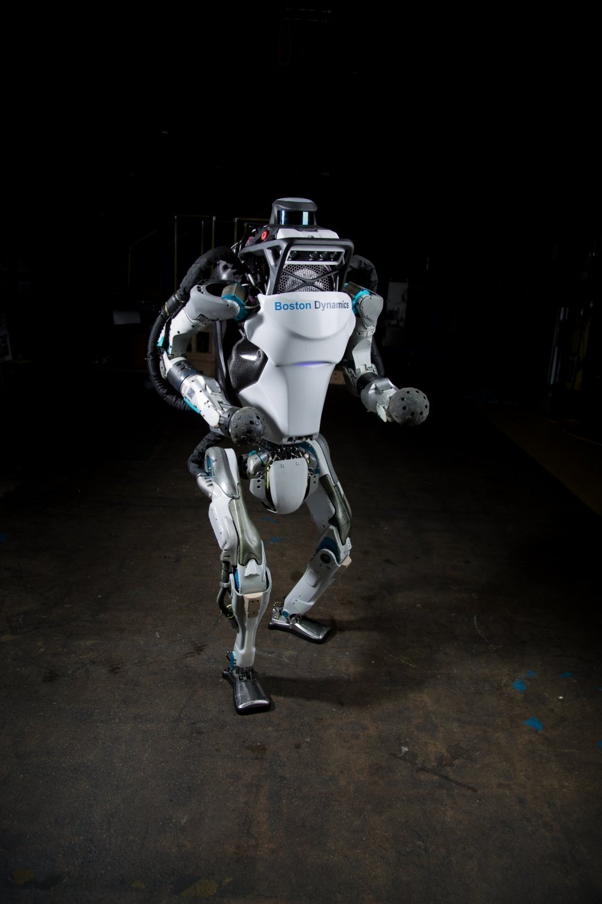

# Atlas

 tag: *Boston Dynamics* *足式* *双足* *地面*
 
 ---

波士顿动力公司的一大力作，可以实现在雪地和不平路面的行走。Atlas可以算是现今人形机器人的巅峰。

first come out: 2013
lastest version: Jul, 2017

- 头顶有激光雷达用于感知环境信息
- 身体多个关节全部采用液压驱动
- 28个关节，双腿12个（和人一样），双手12个，背部3个，脖子1个pitch

2015年的DARPA挑战赛中，这个机器人被分发给6个不同的team进行各自开发进行任务，最高拿到第二名，败于韩国Kaist。