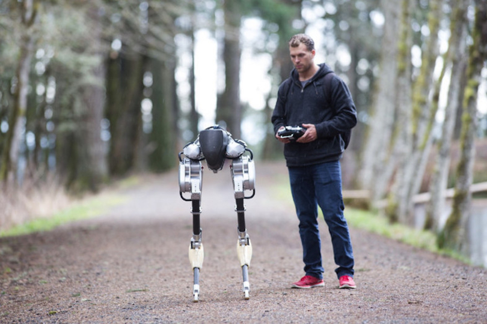
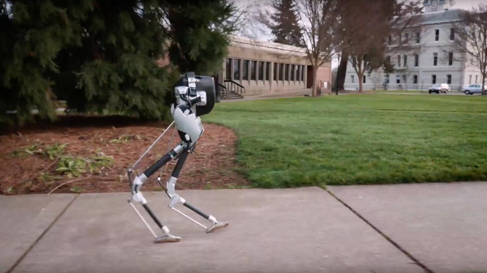

# Cassie
tag: *Agility Robotics* *仿生* *地面* *双足*

---

Fig1. Cassie在野外测试中的样子

Fig2. Cassie在行走中的样子

Cassie是由俄勒冈州立大学出来的初创企业Agility Robotics开发的一个能够双足行走的机器人，外形类似没有头的鸵鸟（虽然官方说他们并不是刻意模仿鸵鸟的）。Agiglity Robotics的成员之前曾开发过类似的研究用双足机器人MARLO与ATRIAS。这两机器人的开发经验奠定了Cassie的基础。

Cassie的行走基于spring-mass model，类似于Boston Dynamics的机器人的行走方式。

## 硬件
Cassie是一个行走时能量利用效率很高的机器人。经过机械结构的优化，控制算法的优化，以及定制的驱动器等，虽然其搭载的电池较小，但依旧能够单次充电运行6～8小时。

Cassie的机械结构的特点：
- 每条腿有4个自由度（非官方数据，通过从图片与视频观察得出）
- 每个关节由电机驱动
- 所有电机均布置在离髋关节（Cassie的话应该叫头？）很近的位置，因此行走时挥动的质量很小，需要的能量就小。
- 膝关节是由电机通过连杆驱动的，并且在膝关节还有一块能够弯曲的弹性板材，充当弹簧的作用。
- 足部面积很小

## 应用场景

其活动范围与人类基本无异，能够到人能所到的地方。

具体的应用场景有：
- 送货，并且可以利用已有的路面与行人道
- 野外探索
- 抢险救灾
- 双足研究平台

## 拓展
[Agility Robotics官网](http://www.agilityrobotics.com/#cover)

[1.视频Cassie](https://www.youtube.com/watch?v=Is4JZqhAy-M)

[2.视频Cassie](https://youtu.be/5YDIzeW42hg)
