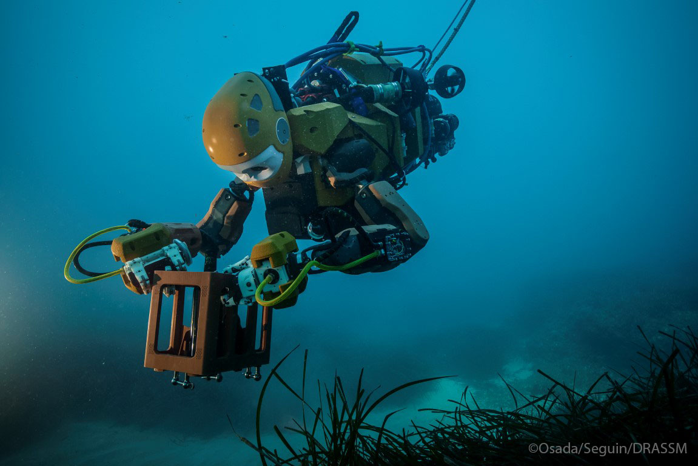

#Ocean One

 tag: *Stanford Robotics Lab* *人形* *水下* *探索*
 
 ---

斯坦福大学机器人实验室开发的人形水下遥操作机器人。上半身像人形，下半身像传统水下机器人。

first come out: 2016

- 头部有两个自由度和双目视觉
- 双臂各有7自由度，力反馈，弹性串联驱动
- 手部是欠驱动抓手，具有触觉和摄像头
- 身体共有8个推进器，以及用于探索，导航，姿态估计用的多个广角摄像头，多普勒测速计，气压计等许多传感器

Video URL：
[Youtube](https://www.youtube.com/watch?v=p1HmgP9l4VY)

News URL：
[IEEE](https://spectrum.ieee.org/automaton/robotics/humanoids/stanford-humanoid-submarine-robot)

Official Site URL：
[cs.stanford.edu](http://cs.stanford.edu/group/manips/ocean-one.html)
