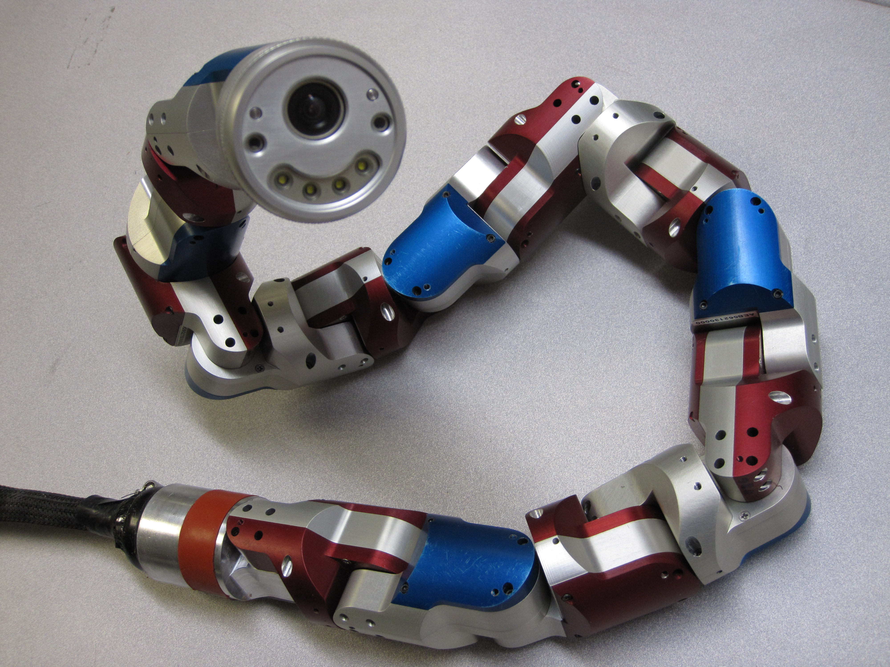

# SEA-Snake
tag: *Biorobotics Lab CMU* *仿生* *地面*

---

Fig. 第一代非SEA的蛇形机器人

Fig. 第二代带SEA的蛇形机器人

蛇形机器人由CMU的Howie Choset带领的Biorobotics Lab开发。其最大的亮点是模块化可拼接的身体。
## 硬件
蛇形机器人的硬件采用模块化的电机连接而成，分为头模块，尾巴模块和躯干模块。模块之间采用232的总线(待考证)通讯，供电采用串接方式。即，每个模块都有4个Pogo pin和4个焊盘，用于连接前、后的模块，其中两个pin为供电，另外两个pin为通讯。每个模块都带有自己的独立控制器，采用STM32F1系列。

- 头模块有探照灯和摄像头。
- 躯干模块有一个运动自由度，由maxon电机，编码器，SEA弹簧系统，惯导模块等组成，这部分构成了机器蛇运动和控制的核心。
- 尾部模块工业连接头拖出总控制线，连接到控制箱进行控制。

第二代蛇形机器人相对第一代，增加了SEA模块，其实本质就是在电机输出轴末端增加柔性弹簧，使单个模块增加柔性（优点）和不可控性（缺点）。SEA的另一个优点是可以做力控，同时带来的缺点是控制频率降低（至于为什么，欢迎@guzhaoyuan讨论）。

## 应用场景
用于军事探测，可进行管道内壁，树干外壁的攀爬

## 拓展
[机器人链接](http://biorobotics.ri.cmu.edu/projects/modsnake/)
[视频第二代SEA-Snake](https://www.youtube.com/watch?v=te4M-b69fVs)
[视频第一代Snake](https://www.youtube.com/watch?v=kNH0eAqz_WU&list=PLfxH9gJUcI6GG0fK4st2L8X_IJWhwlzzb&index=6)
论文：Design and Architecture of a Series Elastic Snake Robot, D. Rollinson, et al.